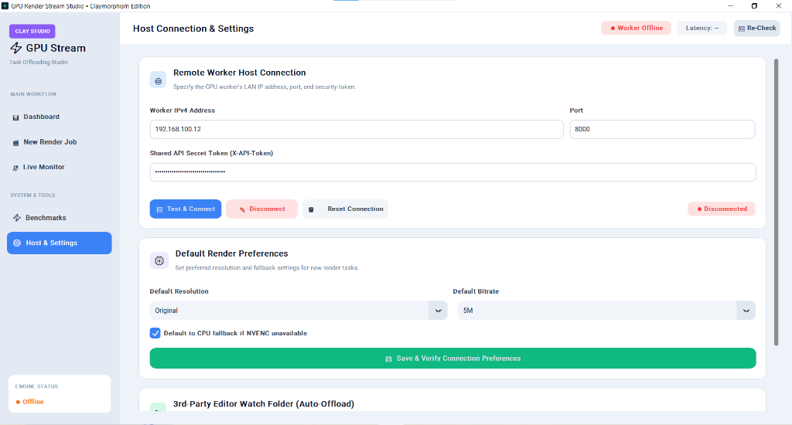
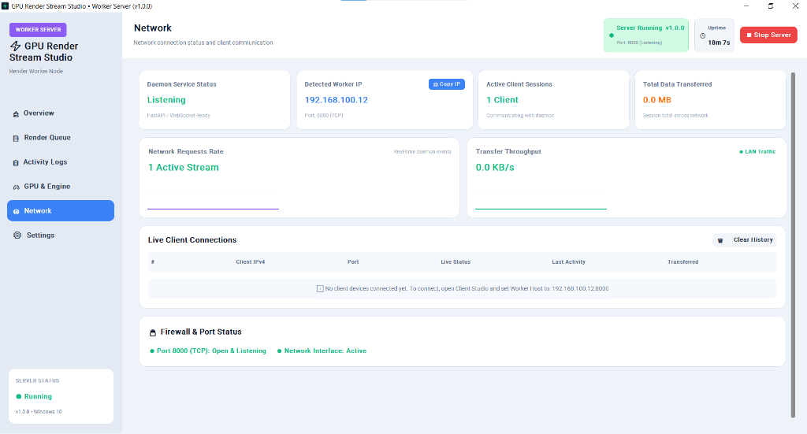
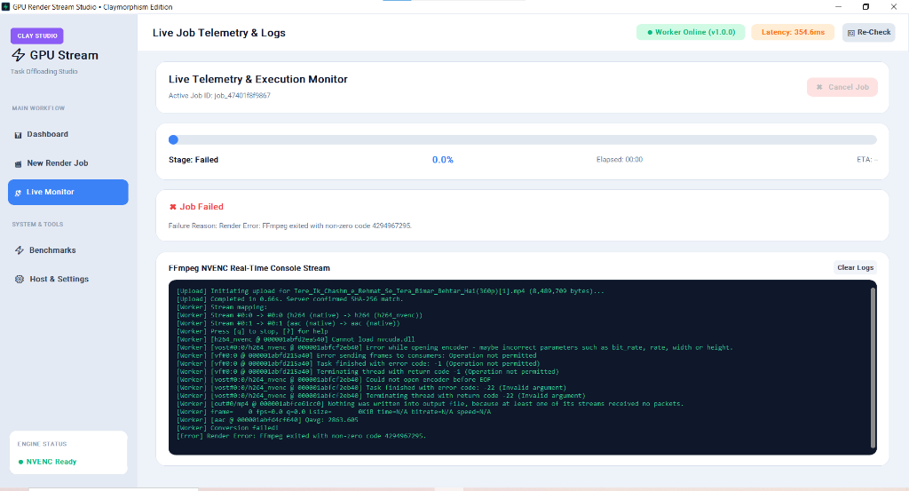
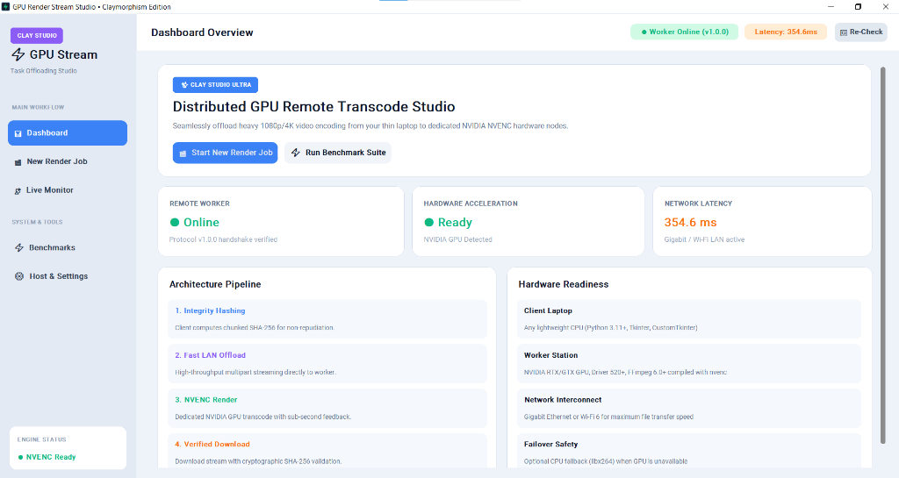
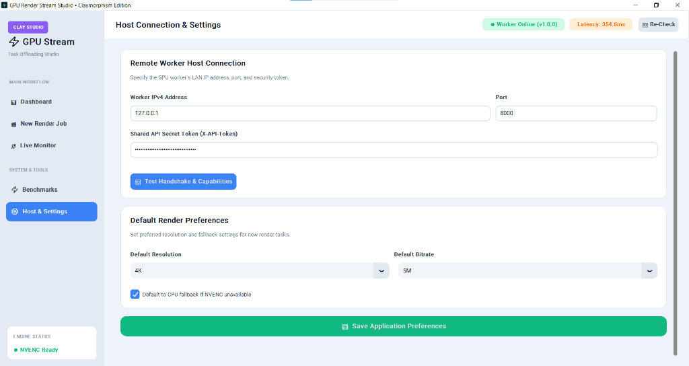
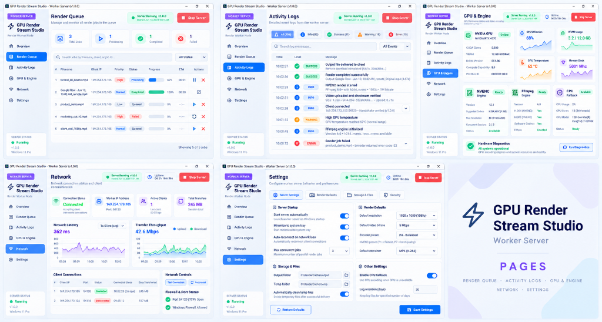
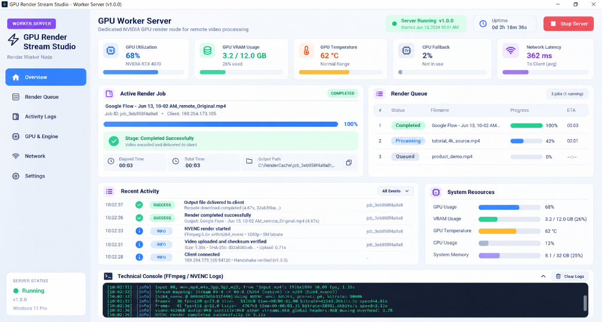
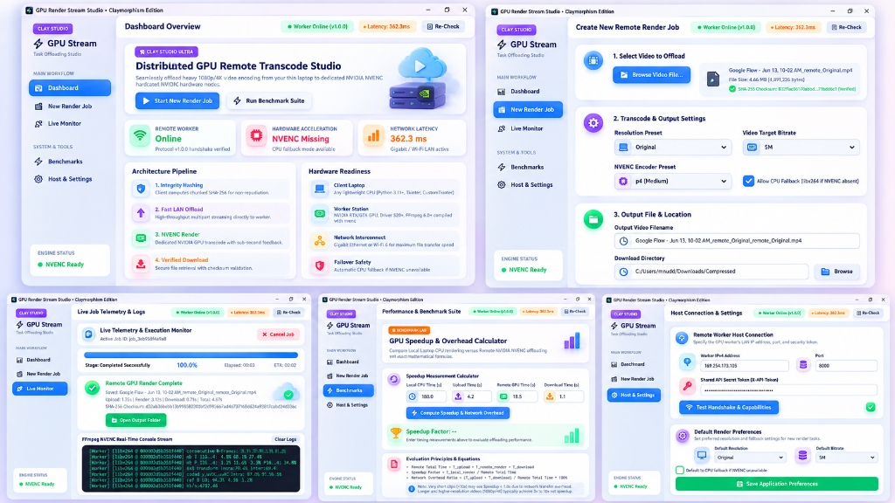
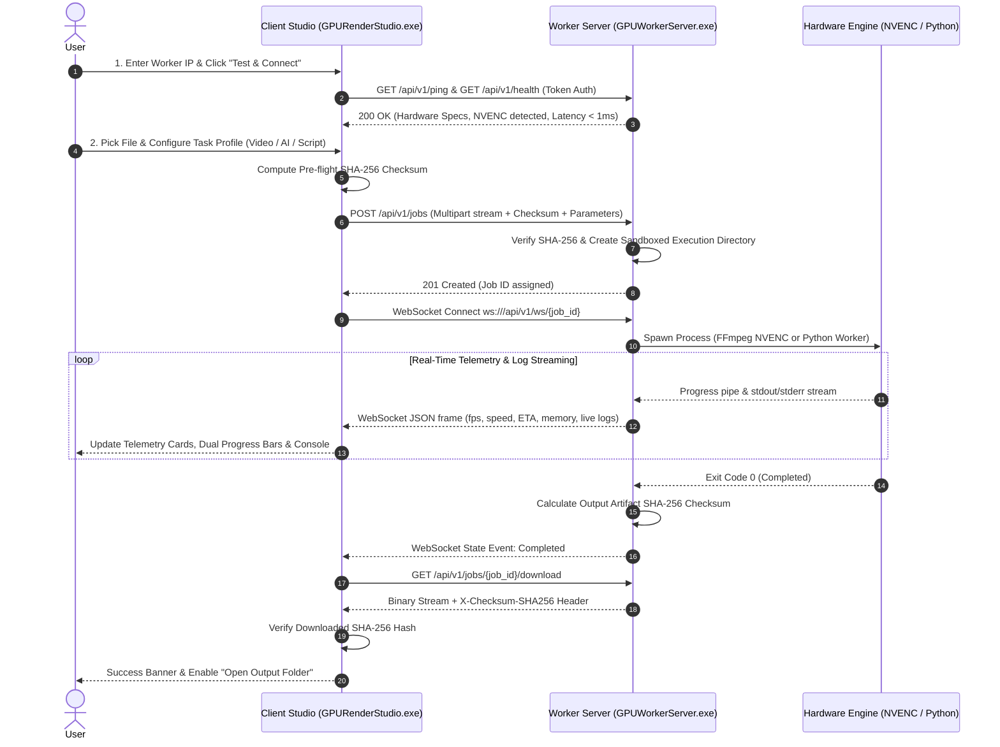

# ⚡ Distributed Task Offloading & Remote GPU Rendering System

[](LICENSE)
[](https://www.python.org/)
[](https://github.com/TomSchimansky/CustomTkinter)
[](https://fastapi.tiangolo.com/)
[](https://developer.nvidia.com/video-encode-decode-gpu-support-matrix)
[-orange.svg)](#-direct-lan-hardware-setup)

A production-grade, distributed task offloading and hardware-accelerated remote computing suite. Designed to offload processor-heavy and GPU-intensive workloads (**4K Video Transcoding**, **Python / AI Model Training**, and **Batch Scripts**) from a low-power client laptop (0% heavy resource usage) to a dedicated worker server PC over a local area network (LAN/Ethernet) with wire-speed throughput and sub-millisecond latency.

---

## 📸 Visual Showcase & Real Application Screenshots

### 1. Dual Control Terminals: Client Studio & Worker Server
| Client Studio (`GPURenderStudio.exe`) | Worker Server (`GPUWorkerServer.exe`) |
| :---: | :---: |
|  |  |
| *Client Studio: Host & Connection Settings with Server Hardware Detection* | *Worker Server: Real-time Network View & Connected Client Monitor* |

---

### 2. Client Studio Screens (`GPURenderStudio.exe`)
| Submit Universal Job | Live Active Job Monitor |
| :---: | :---: |
|  |  |
| *Task Profile Selection (Video, AI Python, Batch Script) & Preset Controls* | *Live Telemetry Cards, Dual Progress Bars & Streaming WebSockets* |

| Render Queue & History | Real-Time Diagnostics |
| :---: | :---: |
|  |  |
| *Task Queue with SHA-256 Checksum Badges & Output Folder Access* | *Round-Trip Latency Graph (< 1ms LAN), Health Checks & Auto-Repair* |

---

### 3. Server Node Screens (`GPUWorkerServer.exe`)
| Hardware Overview & Vitals | GPU Engine Detection & Acceleration |
| :---: | :---: |
|  |  |
| *Real-time CPU Load, Memory Allocation & Worker State* | *Hardware NVENC Engine Verification & Codec Matrix* |

---

### 4. System Architecture Blueprint

*High-level multi-screen UI/UX design blueprint and distributed pipeline.*

---

## 📑 Complete System Manual
For the in-depth screen-by-screen user guide, direct cable setup instructions, and step-by-step offloading walkthroughs, refer to:
👉 **[COMPREHENSIVE_SYSTEM_MANUAL.md](COMPREHENSIVE_SYSTEM_MANUAL.md)**

---

## 💡 Core Architecture & Philosophy

```
+-----------------------------------+                     +-----------------------------------+
|      CLIENT LAPTOP (Thin UI)      |  Cat6 LAN Cable     |     SERVER PC (Compute Node)      |
|  • CustomTkinter Desktop Studio   |<===================>|  • FastAPI High-Speed Daemon      |
|  • Chunked SHA-256 Hashing        |   1 Gbps (~0.5 ms)  |  • Dedicated NVIDIA NVENC / CPU   |
|  • Non-Blocking Async GUI         |   Zero Internet     |  • Isolated Task Sandbox Storage  |
|  • 0% Heavy Load on Battery       |     Required        |  • 100% Workload Execution        |
+-----------------------------------+                     +-----------------------------------+
```

1. **0% Client Laptop Load**: Your laptop acts purely as a thin controller. Whether transcoding a 20 GB video file or training a deep neural network, 100% of the RAM, CPU, and GPU execution occurs on the server PC.
2. **Wire-Speed Deterministic LAN**: Optimized for a direct RJ-45 Ethernet cable link between laptop and PC with sub-millisecond round-trip latency (~0.3 ms – 0.8 ms). No internet connection or cloud subscription required.
3. **End-to-End Cryptographic Integrity**: Every job transfer is protected by pre-flight and post-flight SHA-256 cryptographic checksums.
4. **Universal Compute Support**:
   - 🎬 **Video GPU Transcoding**: Accelerated via FFmpeg `h264_nvenc`, `hevc_nvenc`, and CPU fallback.
   - 🧠 **Python AI / ML Training**: Execute Python scripts (`.py`) on remote server hardware with live stdout/stderr WebSockets.
   - ⚡ **Batch & Shell Execution**: Execute `.bat`, `.cmd`, and `.ps1` automation scripts on the worker node.

---

## 🏗 Sequence & Data Flow



---

## 📂 Repository Structure

```
.
├── COMPREHENSIVE_SYSTEM_MANUAL.md     # In-depth architectural & screen user manual
├── README.md                          # Primary project documentation
├── server_entrypoint.py               # Server UI + FastAPI daemon unified launcher
├── client/
│   ├── app.py                         # Client desktop application entrypoint
│   ├── requirements.txt               # Client Python dependencies
│   ├── tests_client.py                # Client automated test suite
│   ├── services/
│   │   ├── config_manager.py          # Client local configuration persistence
│   │   ├── network_client.py          # HTTP & WebSocket client with SHA-256 hashing
│   │   └── watch_folder.py            # Automated folder monitor daemon
│   └── ui/
│       ├── main_window.py             # Client main navigation shell
│       ├── components/                # Modular UI widgets (sidebar, topbar, sparklines)
│       └── views/
│           ├── settings_view.py       # Host IP & Server Connection view
│           ├── render_job_view.py     # Multi-mode Task Submission view
│           ├── active_job_view.py     # Live Telemetry & Log Streaming view
│           ├── dashboard_view.py      # Render Queue & History view
│           ├── diagnostics_view.py    # Latency & Network Health view
│           └── benchmarks_view.py     # Hardware Benchmarking view
├── server/
│   ├── requirements.txt               # Server dependencies (FastAPI, uvicorn, psutil, etc.)
│   ├── app/
│   │   ├── main.py                    # FastAPI server entrypoint
│   │   ├── config.py                  # Pydantic server settings loader
│   │   ├── server_state.py            # Shared runtime state between GUI and API
│   │   ├── api/
│   │   │   ├── health.py              # Health check & capability endpoints
│   │   │   ├── jobs.py                # Job lifecycle (upload, run, cancel, download)
│   │   │   └── websocket.py           # Real-time WebSocket streaming
│   │   └── services/
│   │       ├── checksum_service.py    # High-performance chunked SHA-256 hasher
│   │       ├── connection_tracker.py  # Active connected client session monitor
│   │       ├── ffmpeg_service.py      # NVENC command generator & progress parser
│   │       ├── job_manager.py         # Universal runner (FFmpeg, Python, Batch scripts)
│   │       ├── security.py            # Path traversal guards & input sanitizer
│   │       └── system_service.py      # NVENC, GPU, CPU, and RAM telemetry provider
│   └── ui/
│       ├── server_window.py           # Server desktop GUI shell
│       └── views/
│           ├── overview_view.py       # System telemetry & hardware vitals
│           ├── queue_view.py          # Server active job queue
│           ├── logs_view.py           # Real-time console activity logs
│           ├── hardware_view.py       # GPU & hardware encoder detection
│           ├── network_view.py        # Detected IP & connected client tracker
│           └── settings_view.py       # Server configuration & worker limits
├── shared/
│   ├── protocol.md                    # REST & WebSocket protocol specification
│   └── schemas.py                     # Shared Pydantic data models
├── docs/
│   ├── architecture.md                # System architecture documentation
│   ├── benchmark_report.md            # Hardware benchmarks & speedup formulas
│   └── screenshots/                   # Application screenshots
└── scripts/
    ├── start_server.bat               # 1-click Windows server runner
    ├── start_client.bat               # 1-click Windows client runner
    ├── render_cli.py                  # Command-line rendering utility
    └── setup_installer.ps1            # Automated environment installer
```

---

## 🔌 Direct LAN Hardware Setup

To connect two machines directly using an Ethernet cable:
1. Connect a standard **RJ-45 Cat5e/Cat6 LAN cable** between the Client Laptop and Worker Server PC.
2. Launch `GPUWorkerServer.exe` on the Server PC.
3. Switch to the **Network** tab to view your detected IPv4 address (e.g. `192.168.100.12`).
4. On the Client Laptop, launch `GPURenderStudio.exe`, enter the Server IP in **Host & Settings**, and click **Test & Connect**.

---

## 📦 Installation & Setup

### Option 1: Standalone Pre-compiled Binaries (.exe)
Both applications are pre-compiled and available in `dist/`:
- **Worker Server:** Run `dist/GPUWorkerServer.exe` on your server PC.
- **Client Studio:** Run `dist/GPURenderStudio.exe` on your client laptop.

### Option 2: Running from Source (Python 3.11+)

1. **Clone the repository:**
   ```powershell
   git clone https://github.com/qu-ddous/Distributed-Task-Offloading-Remote-GPU-Rendering-System.git
   cd Distributed-Task-Offloading-Remote-GPU-Rendering-System
   ```

2. **Server Installation (GPU Machine):**
   ```powershell
   python -m pip install -r server/requirements.txt
   python server_entrypoint.py
   ```

3. **Client Installation (Laptop):**
   ```powershell
   python -m pip install -r client/requirements.txt
   python client/app.py
   ```

---

## 🧪 Automated Testing

Run the test suite to verify checksumming, command generation, and endpoint contracts:
```powershell
python -m pytest -v
```

---

## 📄 License
This project is licensed under the terms of the [MIT License](LICENSE).


