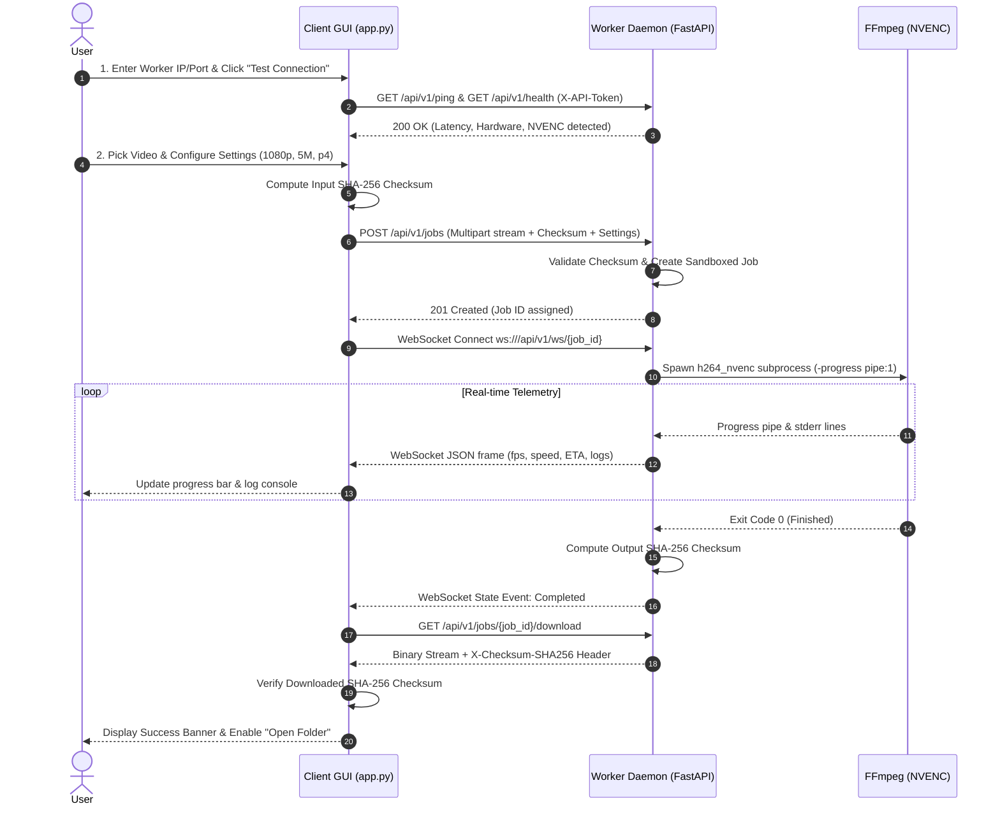

# ⚡ Distributed Task Offloading & Remote GPU Rendering System

[](LICENSE)
[](https://www.python.org/)
[](https://github.com/TomSchimansky/CustomTkinter)
[](https://fastapi.tiangolo.com/)
[](https://developer.nvidia.com/video-encode-decode-gpu-support-matrix)

A production-grade distributed computing system designed to offload video encoding and transcoding workloads from low-power client laptops (e.g., ultrabooks with integrated graphics) to a dedicated desktop or server equipped with an NVIDIA GPU over a local area network (LAN/Wi-Fi).

```
   ┌───────────────────────────────────┐               ┌───────────────────────────────────┐
   │     CLIENT (Low-Powered Laptop)   │               │     WORKER (GPU Compute Station)  │
   │  • CustomTkinter Desktop Studio   │               │  • FastAPI Headless Daemon        │
   │  • Chunked SHA-256 Checksumming   │ ────────────> │  • Isolated Job Sandbox Storage   │
   │  • Async Progress/Log Consumer    │   Local LAN   │  • Hardware NVENC Acceleration    │
   │  • Non-Blocking GUI Threads       │ <──────────── │  • WebSocket Live Telemetry Pipe  │
   └───────────────────────────────────┘               └───────────────────────────────────┘
```

---

## 📋 Table of Contents
1. [Key Features](#-key-features)
2. [Architecture & Workflow](#-architecture--workflow)
3. [Repository Structure](#-repository-structure)
4. [Prerequisites](#-prerequisites)
5. [Installation Guide](#-installation-guide)
6. [FFmpeg & NVIDIA NVENC Setup](#-ffmpeg--nvidia-nvenc-setup)
7. [Local Area Network & Static IP Setup](#-local-area-network--static-ip-setup)
8. [Configuration & Authentication (.env)](#-configuration--authentication-env)
9. [Running the System](#-running-the-system)
10. [Automated Testing & Verification](#-automated-testing--verification)
11. [Running Real Benchmarks](#-running-real-benchmarks)
12. [Troubleshooting & FAQs](#-troubleshooting--faqs)
13. [Limitations & Roadmap](#-limitations--roadmap)

---

## ✨ Key Features

- **True GPU Acceleration**: Direct hardware rendering using FFmpeg `h264_nvenc` with customizable presets (`p1` to `p7`) and bitrates (`2M`, `5M`, `8M`, etc.).
- **Responsive CustomTkinter Studio**: Dark studio interface designed with modern spacing, card containers, and responsive async threads that never freeze during network transfers.
- **Bi-Directional Telemetry**: WebSocket real-time pipe streaming frame-by-frame progress, render speed ($x$), encoding FPS, elapsed time, and ETA calculations.
- **End-to-End Cryptographic Integrity**: Streaming SHA-256 hash validation before transmission, upon upload completion, after remote rendering, and upon client download.
- **Security & Path Isolation**: Safe tokenized FFmpeg subprocess execution without shell interpolation; automated filename sanitization and traversal prevention (`/storage/jobs/{job_id}/`).
- **Resilient Fallback Handling**: Clear error diagnostics if NVENC hardware or drivers are absent, with an explicit, optional CPU fallback (`libx264`).

---

## 🏗 Architecture & Workflow



---

## 📂 Repository Structure

```
.
├── client/
│   ├── app.py                     # Client desktop application entrypoint
│   ├── requirements.txt           # Client-specific Python dependencies
│   ├── tests_client.py            # Client unit tests
│   ├── services/
│   │   ├── config_manager.py      # Local settings persistence (client_settings.json)
│   │   └── network_client.py      # REST & WebSocket communications with SHA-256 hashing
│   └── ui/
│       └── main_window.py         # CustomTkinter GUI studio implementation
├── server/
│   ├── .env.example               # Server daemon environment template
│   ├── requirements.txt           # Server dependencies (FastAPI, uvicorn, websockets, etc.)
│   ├── app/
│   │   ├── __init__.py
│   │   ├── config.py              # Pydantic Settings configuration loader
│   │   ├── main.py                # FastAPI server entrypoint and lifespan manager
│   │   ├── api/
│   │   │   ├── health.py          # /health & /ping endpoints
│   │   │   ├── jobs.py            # /jobs CRUD, upload, cancel, download endpoints
│   │   │   └── websocket.py       # Live telemetry and log streaming router
│   │   └── services/
│   │       ├── checksum_service.py # High-performance chunked SHA-256 hashing
│   │       ├── ffmpeg_service.py   # Safe command generator & progress parser
│   │       ├── job_manager.py     # Job queue, semaphore execution & subprocessing
│   │       ├── security.py        # Filename sanitization & path traversal guards
│   │       └── system_service.py  # NVENC, GPU, CPU, and disk space capability detection
│   └── tests/
│       └── test_server.py         # Pytest suite with mock processes & protocol validation
├── shared/
│   ├── protocol.md                # REST & WebSocket API specification (v1.0.0)
│   └── schemas.py                 # Shared Pydantic models across client and server
├── docs/
│   ├── architecture.md            # Deep-dive architecture and design principles
│   ├── benchmark_report.md        # Reproducible benchmarking guide and templates
│   ├── screenshots/               # Screenshot artifacts & submission checklist
│   └── demos/                     # Demo video/GIF captures
├── scripts/
│   ├── start_server.bat           # 1-click Windows server launcher
│   ├── start_client.bat           # 1-click Windows client launcher
│   ├── start_server.sh            # 1-click Linux/macOS server launcher
│   └── start_client.sh            # 1-click Linux/macOS client launcher
├── .gitignore
├── LICENSE                        # MIT License
└── README.md                      # Comprehensive user & developer documentation
```

---

## 💻 Prerequisites

- **Python**: Version 3.11 or newer (tested with Python 3.11, 3.12, 3.13, 3.14).
- **Worker Computer Hardware**:
  - NVIDIA GeForce, Quadro, Tesla, or RTX GPU supporting NVENC ([NVIDIA Matrix](https://developer.nvidia.com/video-encode-decode-gpu-support-matrix)).
  - NVIDIA Driver 520.00+ installed.
  - FFmpeg compiled with `--enable-nvenc` available on system `PATH`.
- **Client Computer Hardware**:
  - Any standard Windows, Linux, or macOS laptop/PC with Python 3.11+.

---

## 📦 Installation Guide

### Windows Setup (Recommended)

1. **Clone the repository:**
   ```powershell
   git clone https://github.com/YourUsername/Distributed-Task-Offloading-Remote-GPU-Rendering-System.git
   cd Distributed-Task-Offloading-Remote-GPU-Rendering-System
   ```

2. **Set up Worker Computer (GPU Machine):**
   ```powershell
   # Install server requirements
   python -m pip install -r server/requirements.txt

   # Create your local .env configuration
   Copy-Item server/.env.example server/.env
   ```

3. **Set up Client Computer (Laptop):**
   ```powershell
   # Install client requirements
   python -m pip install -r client/requirements.txt
   ```

### Linux Setup (Worker or Client)

```bash
# Worker workstation:
sudo apt-get update && sudo apt-get install -y ffmpeg
pip install -r server/requirements.txt
cp server/.env.example server/.env

# Client workstation:
sudo apt-get install -y python3-tk
pip install -r client/requirements.txt
```

---

## 🚀 FFmpeg & NVIDIA NVENC Setup

### 1. Verify FFmpeg on Worker
Open PowerShell or bash on the worker machine:
```powershell
ffmpeg -version
```

### 2. Verify NVIDIA Driver & GPU
```powershell
nvidia-smi
```

### 3. Verify NVENC Codec Support
Run the following command to check if FFmpeg sees your NVIDIA encoder:
```powershell
ffmpeg -encoders | findstr nvenc    # (Windows)
ffmpeg -encoders | grep nvenc       # (Linux)
```
*Expected output includes `h264_nvenc` and `hevc_nvenc`.*

---

## 🌐 Local Area Network & Static IP Setup

To connect two computers on a local network (over Wi-Fi or Ethernet cable):

### 1. Find Local IP Addresses
- **Windows Worker**: Run `ipconfig` in PowerShell. Look for **IPv4 Address** under your active Wi-Fi or Ethernet adapter (e.g., `192.168.1.150`).
- **Linux Worker**: Run `ip addr show` or `hostname -I`.

### 2. (Optional) Set a Static IP on Windows Worker
1. Open **Settings** ➔ **Network & internet** ➔ **Wi-Fi** (or **Ethernet**).
2. Click **Hardware properties** ➔ **IP assignment** ➔ **Edit**.
3. Select **Manual** ➔ Turn on **IPv4**.
4. Example configuration:
   - IP Address: `192.168.1.150` *(choose an address outside router's DHCP range)*
   - Subnet Prefix Length: `24` (Subnet mask `255.255.255.0`)
   - Gateway: `192.168.1.1`
   - Preferred DNS: `1.1.1.1`

### 3. Configure Windows Firewall on Worker
Allow incoming traffic on port `8000`:
```powershell
# Run in Administrator PowerShell on the Worker:
New-NetFirewallRule -DisplayName "GPU Render Daemon Port 8000" -Direction Inbound -LocalPort 8000 -Protocol TCP -Action Allow
```

### 4. Verify Connectivity from Client Laptop
From your client laptop, test reachability:
```powershell
ping 192.168.1.150
curl http://192.168.1.150:8000/api/v1/ping
```

---

## 🔑 Configuration & Authentication (.env)

Edit `server/.env` on the worker machine:
```ini
HOST=0.0.0.0
PORT=8000
API_TOKEN=supersecret-render-token-change-me
STORAGE_DIR=storage/jobs
MAX_UPLOAD_SIZE=2147483648
MAX_CONCURRENT_JOBS=1
ALLOW_CPU_FALLBACK=false
```

> [!IMPORTANT]
> Ensure the **API_TOKEN** entered in the Client Desktop application matches the `API_TOKEN` configured in `server/.env`.

---

## 🏃 Running the System

### 1. Start Worker Daemon (GPU Machine)
- **Windows**: Double-click `scripts/start_server.bat` or run:
  ```powershell
  python -m uvicorn server.app.main:app --host 0.0.0.0 --port 8000
  ```
- **Linux**: Run `./scripts/start_server.sh`.

### 2. Launch Client Desktop Application (Laptop)
- **Windows**: Double-click `scripts/start_client.bat` or run:
  ```powershell
  python client/app.py
  ```
- **Linux**: Run `./scripts/start_client.sh`.

### 3. Render a Video
1. Enter Worker IP (e.g. `192.168.1.150`), Port `8000`, and your Token.
2. Click **Test Connection** (green indicators confirm online status and NVENC readiness).
3. Click **Browse Video File...** to select your video.
4. Select resolution preset (e.g., `1080p`), bitrate (e.g., `5M`), and NVENC preset (`p4`).
5. Click **Submit & Render Remotely**.
6. Monitor live progress, encoding FPS, ETA, and streaming worker logs.
7. Upon completion, the client validates the downloaded output SHA-256 and provides an **Open Output Folder** button.

---

## 🧪 Automated Testing & Verification

The test suite covers handshake negotiation, path safety, checksum verification, FFmpeg command generation, and progress parsing without requiring an NVIDIA GPU:

```powershell
# Run entire test suite
python -m pytest -v
```

### Test Coverage Breakdown
- `server/tests/test_server.py`:
  - `test_ping_endpoint`: Verifies latency ping response.
  - `test_health_endpoint_auth_and_protocol`: Verifies token authentication & schema metadata.
  - `test_security_filename_sanitization`: Prevents directory traversal tricks.
  - `test_path_safety_validation`: Enforces job sandbox boundary confinement.
  - `test_ffmpeg_command_construction`: Tests exact flag assembly for NVENC and CPU fallback.
  - `test_ffmpeg_progress_parsing`: Verifies parsing of FFmpeg `-progress pipe:1` microseconds and clock formats.
  - `test_job_upload_checksum_verification`: Tests SHA-256 matching and automatic rejection on mismatch.
- `client/tests_client.py`:
  - `test_config_manager_load_and_save`: Tests client preferences persistence.
  - `test_client_sha256_computation`: Tests chunked SHA-256 hashing and progress callbacks.
  - `test_network_client_headers`: Tests token header attachment.

---

## 📊 Running Real Benchmarks

See [`docs/benchmark_report.md`](docs/benchmark_report.md) for the exact benchmarking protocol, hardware logging sheets, and speedup formulas:

$$\text{Speedup Factor} = \frac{T_{\text{local\_render}}}{T_{\text{upload}} + T_{\text{remote\_render}} + T_{\text{download}}}$$

---

## 🛠 Troubleshooting & FAQs

| Issue | Cause | Resolution |
| :--- | :--- | :--- |
| **Worker status shows Offline** | Firewall blocking or incorrect IP | Verify worker IP with `ipconfig`, check firewall rule for port 8000, and ensure server is bound to `0.0.0.0`. |
| **Authentication Failed (401)** | Token mismatch | Ensure the token in the client top bar matches `API_TOKEN` in `server/.env`. |
| **NVENC: Not Detected** | Missing NVIDIA driver or FFmpeg build without NVENC | Run `nvidia-smi` and `ffmpeg -encoders`. If on a non-NVIDIA machine, check "Allow CPU Fallback". |
| **Checksum Mismatch (400)** | Network transmission corruption | The system automatically purged the corrupt file. Retry upload over a stable connection. |
| **Connection Timed Out** | Wrong IP address or device asleep | Wake worker computer and re-test connection. |

---

## 📜 Limitations & Roadmap

- **Single Active Encode Slot**: Default `MAX_CONCURRENT_JOBS=1` serializes jobs to prioritize dedicated NVENC throughput. Configurable in `.env`.
- **LAN-Optimized**: Designed for local trusted subnets; for WAN deployment, a reverse proxy with TLS (HTTPS/WSS) is recommended.
- **Future Enhancements**: Support for AV1 NVENC (`av1_nvenc`), multi-node worker clusters, and audio waveform extraction previews.

---

## 📄 License
This project is licensed under the terms of the [MIT License](LICENSE).