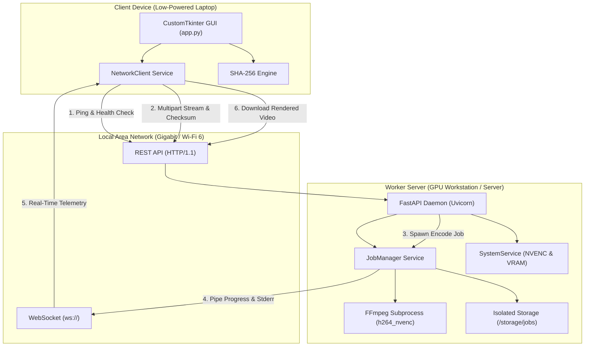

# Distributed Remote GPU Rendering System: Architecture & Design

## 1. System Overview
The **Distributed Remote GPU Rendering System** is engineered to enable thin/low-power client devices (e.g., ultrabooks, laptops with integrated graphics) to offload heavy video rendering and transcoding workloads to a dedicated GPU compute worker located on the local network (LAN / Wi-Fi).

---

## 2. Core Architectural Pillars

### 2.1 Non-Blocking Responsive Client Architecture
- **GUI Thread Protection**: Tkinter / CustomTkinter GUI loops remain strictly non-blocking.
- **Worker Threads**: All I/O operations (file hashing, HTTP multipart streaming, file downloading) run in background worker threads (`threading.Thread`).
- **Async WebSocket Thread**: A dedicated event loop manages the persistent WebSocket connection, streaming live updates back to the UI queue using `app.after(0, ...)`.

### 2.2 Security & Path Traversal Mitigation
- Uploaded filenames are sanitized by stripping path separators (`..`, `/`, `\`) and non-whitelisted characters.
- Job directories are strictly isolated: `storage/jobs/{job_id}/input/` and `storage/jobs/{job_id}/output/`.
- Path traversal verification confirms that every accessed or served file is canonicalized and resides strictly within its authorized job sandbox.
- Shared Secret API token (`X-API-Token`) guards all operational endpoints.

### 2.3 End-to-End Cryptographic File Integrity
1. **Client Calculation**: Client computes SHA-256 over chunks of the source file prior to transmission.
2. **Server Verification**: The server calculates SHA-256 on-the-fly as chunks arrive from the network. If hashes mismatch, the file is scrubbed immediately and the upload is rejected (`400 Bad Request`).
3. **Post-Render Verification**: When FFmpeg completes encoding, the server calculates the output file SHA-256 and includes it in the completion payload.
4. **Post-Download Verification**: The client hashes the downloaded output file and confirms that it matches the server's post-render hash before confirming success to the user.

### 2.4 FFmpeg Subprocess & NVENC Telemetry
- Subprocesses are spawned directly using `asyncio.create_subprocess_exec` with tokenized argument arrays (strictly avoiding `shell=True`).
- Real-time progress is streamed via `-progress pipe:1` and `-nostats`.
- Output parsing extracts `out_time_us`, `fps`, and `speed`.
- Percentage is computed relative to the probed duration from `ffprobe`. If duration cannot be determined, progress is flagged as indeterminate rather than fabricated.
